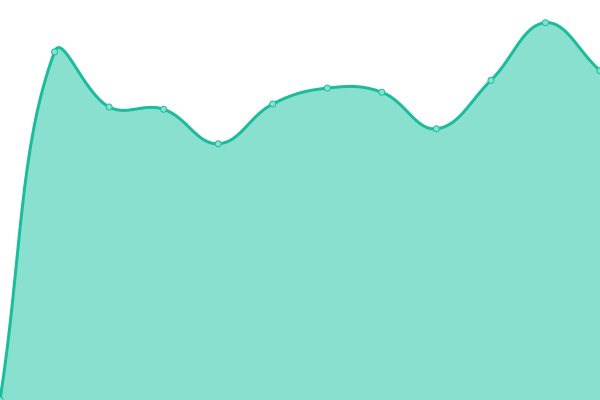
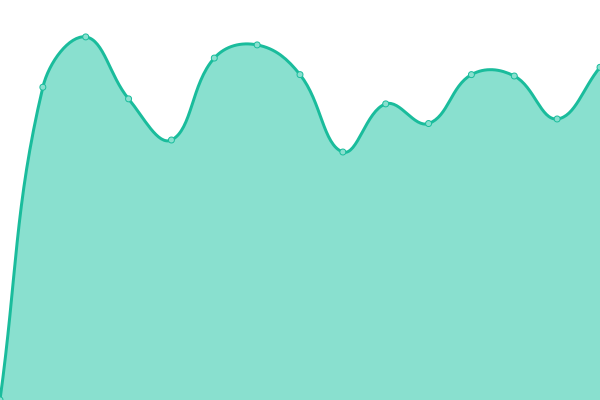
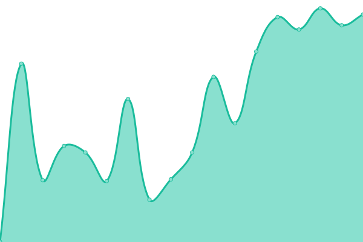
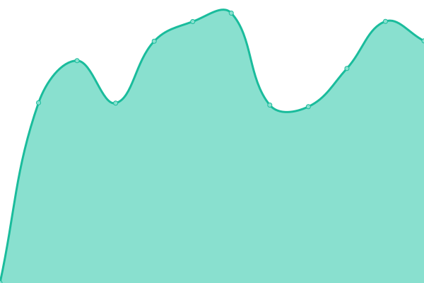
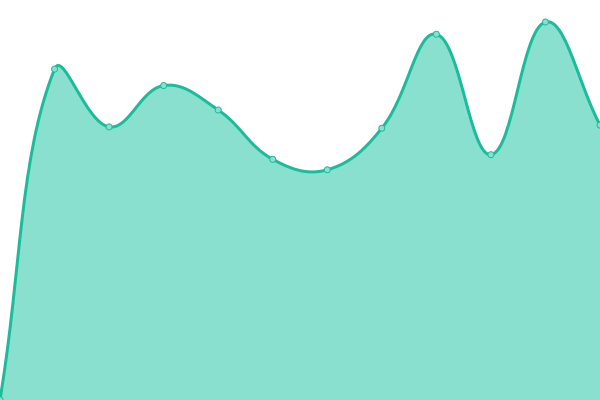
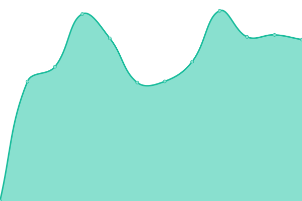

# [📈 Live Status](https://zdenekgreat.github.io/monitoring): <!--live status--> **🟩 All systems operational**

This repository contains the open-source uptime monitor and status page for [Rider-X](https://zdenekgreat.github.io/monitoring), powered by [Upptime](https://github.com/upptime/upptime).

With [Upptime](https://upptime.js.org), you can get your own unlimited and free uptime monitor and status page, powered entirely by a GitHub repository. We use [Issues](https://github.com/zdenekgreat/monitoring/issues) as incident reports, [Actions](https://github.com/zdenekgreat/monitoring/actions) as uptime monitors, and [Pages](https://zdenekgreat.github.io/monitoring) for the status page.

<!--start: status pages-->
<!-- This summary is generated by Upptime (https://github.com/upptime/upptime) -->
<!-- Do not edit this manually, your changes will be overwritten -->
<!-- prettier-ignore -->
| URL | Status | History | Response Time | Uptime |
| --- | ------ | ------- | ------------- | ------ |
|  [Exil](https://www.exil.cz) | 🟩 Up | [exil.yml](https://github.com/zdenekgreat/monitoring/commits/HEAD/history/exil.yml) | 

 2067ms
     
 | 

<a href="https://zdenekgreat.github.io/monitoring/history/exil">100.00%</a>
    

|  [Dětské Skicentrum](https://detskeskicentrum.cz) | 🟩 Up | [detske-skicentrum.yml](https://github.com/zdenekgreat/monitoring/commits/HEAD/history/detske-skicentrum.yml) | 

 1589ms
     
 | 

<a href="https://zdenekgreat.github.io/monitoring/history/detske-skicentrum">100.00%</a>
    

|  [Pujčovna OL](https://pujcovnalyziolomouc.cz/) | 🟩 Up | [pujcovna-ol.yml](https://github.com/zdenekgreat/monitoring/commits/HEAD/history/pujcovna-ol.yml) | 

 1465ms
     
 | 

<a href="https://zdenekgreat.github.io/monitoring/history/pujcovna-ol">100.00%</a>
    

|  [Go Ski](https://goski.cz) | 🟩 Up | [go-ski.yml](https://github.com/zdenekgreat/monitoring/commits/HEAD/history/go-ski.yml) | 

 2706ms
     
 | 

<a href="https://zdenekgreat.github.io/monitoring/history/go-ski">100.00%</a>
    

|  [Můjdash.cz](https://www.mujdash.cz/) | 🟩 Up | [mujdash-cz.yml](https://github.com/zdenekgreat/monitoring/commits/HEAD/history/mujdash-cz.yml) | 

 704ms
     
 | 

<a href="https://zdenekgreat.github.io/monitoring/history/mujdash-cz">100.00%</a>
    

|  [Summit Tattoo](https://summittattoo.cz/) | 🟩 Up | [summit-tattoo.yml](https://github.com/zdenekgreat/monitoring/commits/HEAD/history/summit-tattoo.yml) | 

 1098ms
     
 | 

<a href="https://zdenekgreat.github.io/monitoring/history/summit-tattoo">100.00%</a>
    

|  [Buclík detailing](https://buclik.cz/) | 🟩 Up | [buclik-detailing.yml](https://github.com/zdenekgreat/monitoring/commits/HEAD/history/buclik-detailing.yml) | 

 1101ms
     
 | 

<a href="https://zdenekgreat.github.io/monitoring/history/buclik-detailing">100.00%</a>
    

|  [Great Idea](https://greatidea.cz) | 🟩 Up | [great-idea.yml](https://github.com/zdenekgreat/monitoring/commits/HEAD/history/great-idea.yml) | 

 832ms
     
 | 

<a href="https://zdenekgreat.github.io/monitoring/history/great-idea">100.00%</a>
    

<!--end: status pages-->

[**Visit our status website →**](https://zdenekgreat.github.io/monitoring)

## 📄 License

- Powered by: [Upptime](https://github.com/upptime/upptime)
- Code: [MIT](./LICENSE) © [Anand Chowdhary](https://anandchowdhary.com), supported by [Pabio](https://pabio.com)
- Data in the `./history` directory: [Open Database License](https://opendatacommons.org/licenses/odbl/1-0/)
